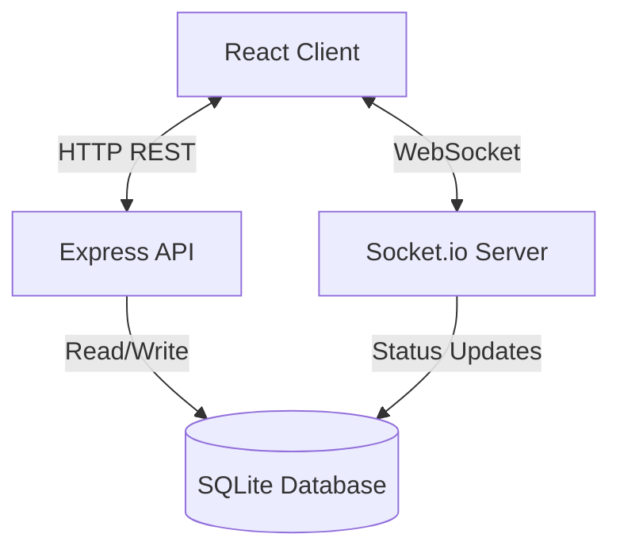

# FamTalk - Technical Blueprint

## 1. Project Overview
**FamTalk** is a modern, real-time web messaging application designed to facilitate seamless one-on-one communication. Inspired by the clean aesthetics of WhatsApp Web, FamTalk prioritizes accessibility by using email-based authentication, removing the barrier of phone number requirements.

**Primary Goals:**
-   **Simplicity:** Minimalist UI/UX focusing on the chat experience.
-   **Real-time:** Instant message delivery and status updates.
-   **Security:** Industry-standard authentication and data protection.
-   **Responsive:** optimized for both desktop and mobile web experiences.

## 2. Core Features & Functionality
-   **User Authentication:** Secure Sign Up and Login using Email/Password.
-   **Real-time Messaging:** Instant text messaging via WebSockets.
-   **User Discovery:** Search functionality to find users by email or username.
-   **Presence System:** Real-time Online/Offline status indicators.
-   **Chat History:** Persistent message history stored in a relational database.
-   **Responsive UI:** Mobile-first design approach using Tailwind CSS.
-   **Interactive Elements:** Visual feedback for message states (optimistic UI).

## 3. User Flow
1.  **Onboarding:**
    *   User lands on Auth Page.
    *   Selects "Sign Up" -> Enters Username, Email, Password.
    *   Upon success, auto-login and redirect to Chat Dashboard.
2.  **Login:**
    *   Existing user enters Email & Password.
    *   System authenticates and issues JWT.
    *   Redirect to Chat Dashboard.
3.  **Discovery & Chat:**
    *   User sees a list of existing chats (sidebar).
    *   User uses "Search" to find a new person by email/username.
    *   Clicking a user activates the Chat Window.
4.  **Messaging:**
    *   User types and sends a message.
    *   Message appears instantly (Optimistic UI).
    *   Recipient receives message in real-time.
5.  **Logout:**
    *   User clicks logout -> Token cleared -> Socket disconnected -> Redirect to Auth.

## 4. System Architecture
The system follows a classic **Client-Server** architecture with a **Real-time Event Layer**.

### 4.1 Frontend (Client)
-   **Framework:** React (Vite)
-   **Styling:** Tailwind CSS (Utility-first)
-   **State Management:** Zustand (Lightweight store for Auth, Messages, Socket)
-   **Routing:** React Router DOM

### 4.2 Backend (Server)
-   **Runtime:** Node.js
-   **Framework:** Express.js (REST API)
-   **Real-time Engine:** Socket.io (Bi-directional communication)
-   **ORM:** Prisma (Type-safe database client)

### 4.3 Database
-   **Engine:** SQLite (Portable, file-based SQL DB)
-   **Schema:** Relational (Users, Messages)

## 5. Authentication Design
-   **Method:** Email & Password.
-   **Password Security:** Passwords are hashed using `bcrypt` before storage. Never stored in plain text.
-   **Session Management:**
    *   **JWT (JSON Web Tokens):** Issued upon Login/Signup.
    *   **Storage:** Stored in Client `localStorage`.
    *   **Verification:** Sent in HTTP `Authorization` headers (Bearer Token) and Socket Handshake.

## 6. Messaging System Design
-   **Protocol:** WebSocket (via Socket.io).
-   **Events:**
    *   `join`: User connects, status set to "Online".
    *   `send_message`: Client sends payload `{content, receiverId}`.
    *   `receive_message`: Server pushes payload to Recipient.
    *   `disconnect`: User disconnects, status set to "Offline".
-   **Persistence:** All messages are saved to the SQLite database via Prisma *before* or *concurrently* with socket events to ensure history is preserved.

## 7. Database Schema

### `User` Table
| Field | Type | Attributes |
| :--- | :--- | :--- |
| `id` | Int | PK, Auto-increment |
| `username` | String | Unique |
| `email` | String | Unique |
| `password` | String | Hashed |
| `avatarUrl` | String | |
| `isOnline` | Boolean | Default: false |
| `createdAt` | DateTime | |

### `Message` Table
| Field | Type | Attributes |
| :--- | :--- | :--- |
| `id` | Int | PK, Auto-increment |
| `content` | String | |
| `senderId` | Int | FK -> User.id |
| `receiverId` | Int | FK -> User.id |
| `isRead` | Boolean | Default: false |
| `createdAt` | DateTime | |

## 8. API Design

### Auth
-   `POST /api/auth/register` - Create account.
-   `POST /api/auth/login` - Validate credentials, return JWT.
-   `GET /api/auth/me` - Validate token, return user profile.

### Users
-   `GET /api/users?search=query` - Search users by name/email.

### Messages
-   `GET /api/messages/:userId` - Retrieve conversation history with a specific user.

## 9. Scalability & Security Considerations

### Security
-   **Input Validation:** Sanitize all inputs to prevent injection.
-   **CORS:** Restrict API access to trusted domains (Client origin).
-   **Rate Limiting:** (Future) Implement to prevent abuse.
-   **Environment Variables:** Secrets (JWT Key, DB URL) stored in `.env`.

### Scalability (Future Roadmap)
-   **Database:** Migrate SQLite to PostgreSQL for high-concurrency production environments.
-   **Redis Adapter:** Use Redis for Socket.io adapter to support multiple server instances (horizontal scaling).
-   **CDN:** Offload static assets and media (Avatars/Images) to Cloud/CDN.
